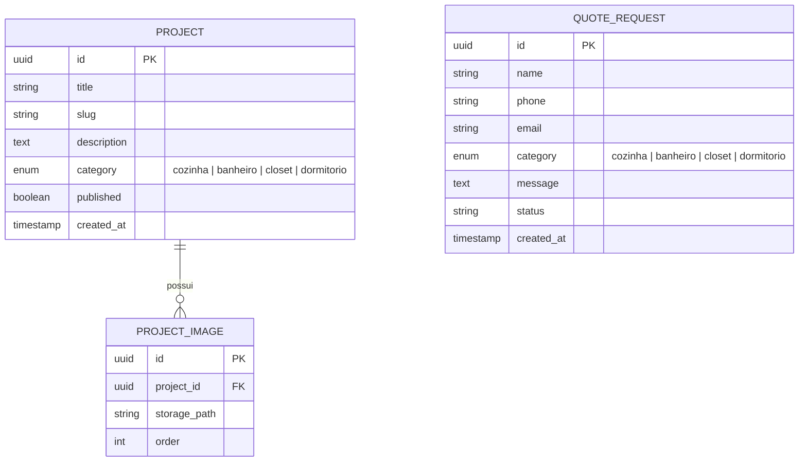

# Arquitetura

## Stack recomendada

Mantendo a stack já definida no `PROJECT.md`:

| Camada | Tecnologia | Observação |
|--------|-----------|------------|
| Framework web | Next.js (App Router) | SSR/SSG/ISR para páginas de portfólio e landing; API routes/Server Actions para o backend simples do MVP. |
| Linguagem | TypeScript | Tipagem em todo o projeto, incluindo tipos gerados do schema do Supabase. |
| Estilização | Tailwind CSS | Utilitário, produtividade alta para site institucional. |
| Componentes | shadcn/ui | Componentes acessíveis (Radix UI) e customizáveis para landing page e painel admin. |
| Backend/dados | Supabase (Postgres + Auth + Storage) | Banco de dados relacional, autenticação do admin e armazenamento de imagens do portfólio. |
| Hospedagem/deploy | Vercel | Deploy contínuo integrado ao Next.js. |

Bibliotecas complementares sugeridas (a confirmar conforme necessidade):
- `react-hook-form` + `zod` — formulário de orçamento com validação.
- `@supabase/ssr` ou `@supabase/auth-helpers-nextjs` — integração de auth no App Router.

## Estrutura inicial de pastas

```
cozinhas_planejadas/
├── docs/                        # documentação do projeto
├── public/                      # assets estáticos (favicon, imagens fixas)
├── src/
│   ├── app/
│   │   ├── (site)/              # rotas públicas do site institucional
│   │   │   ├── page.tsx         # landing page
│   │   │   ├── portfolio/
│   │   │   │   ├── page.tsx     # listagem de projetos
│   │   │   │   └── [slug]/page.tsx  # detalhe do projeto
│   │   │   ├── orcamento/page.tsx   # formulário de orçamento
│   │   │   └── contato/page.tsx
│   │   ├── admin/               # rotas protegidas do painel administrativo
│   │   │   ├── login/page.tsx
│   │   │   ├── projetos/
│   │   │   └── orcamentos/
│   │   └── api/                 # somente para casos que Server Actions não cobrem
│   │                             # (ex.: webhooks externos). Não criar rotas REST
│   │                             # para CRUD/formulário no MVP — usar Server Actions.
│   ├── components/
│   │   ├── ui/                  # componentes shadcn/ui
│   │   ├── site/                # componentes específicos do site público
│   │   └── admin/               # componentes específicos do painel admin
│   ├── lib/
│   │   ├── supabase/            # clients (server/browser) e helpers
│   │   └── validations/         # schemas zod
│   ├── types/                   # tipos TypeScript (incluindo tipos gerados do Supabase)
│   └── styles/
├── supabase/
│   └── migrations/               # migrations SQL do banco
├── .env.local
├── next.config.js
├── tailwind.config.ts
└── package.json
```

## Modelo inicial de entidades

> **Revisado após análise de arquitetura (2026-07-08):** o modelo original tinha uma tabela `Category` e uma tabela `AdminUser` que foram removidas do MVP por serem entidades desnecessárias nesta fase — ver justificativa em [[decisoes-tecnicas]].

Entidades principais previstas para o MVP:

- **Project** (projeto do portfólio)
- **ProjectImage** (imagens associadas a um projeto)
- **QuoteRequest** (pedido de orçamento / lead)

Categorias (cozinha, banheiro, closet, dormitório) são modeladas como um **enum do Postgres** (`project_category`), não como uma tabela própria — não há requisito de cadastro dinâmico de categorias no MVP, então uma tabela extra com FK só adicionaria uma junção e uma tela de CRUD sem necessidade real. Administradores são geridos diretamente pelo **Supabase Auth** (`auth.users`), sem tabela própria — uma tabela `AdminUser` com `role` só se justifica quando houver múltiplos perfis de permissão (backlog P2).



Notas:
- `QUOTE_REQUEST.status` sugerido como enum: `new`, `contacted`, `converted`, `discarded`.
- `PROJECT_IMAGE` não tem `is_cover`: a convenção é que a imagem com menor `order` é a capa — evita um campo extra e a necessidade de manter os dois consistentes.
- Imagens armazenadas no Supabase Storage; `storage_path` referencia o objeto no bucket.
- Se no futuro o cliente precisar gerenciar categorias dinamicamente (adicionar/remover sem deploy), migrar o enum para uma tabela `Category` é uma alteração isolada e de baixo risco — não é necessário antecipar isso agora.

## Segurança de dados (RLS)

O Supabase Postgres deve ter Row Level Security habilitada em todas as tabelas desde a criação do schema:

- `PROJECT` / `PROJECT_IMAGE`: leitura pública liberada apenas para registros `published = true`; escrita restrita a usuários autenticados (admin).
- `QUOTE_REQUEST`: **inserção pública liberada** (para o formulário funcionar sem login), mas **leitura e atualização restritas a usuários autenticados** — do contrário, qualquer visitante poderia ler os dados de contato de outros leads.
- A chave `service_role` do Supabase nunca deve ser usada no client/browser, apenas em contexto server-side (Server Actions/rotas server-only).

## Performance

- Usar **ISR** (Incremental Static Regeneration) nas páginas de listagem e detalhe do portfólio, com revalidação sob demanda ao publicar/editar um projeto no admin, em vez de SSR a cada requisição.
- Preferir **Server Components** por padrão; usar Client Components apenas onde há interatividade real (filtro de categoria no portfólio, formulário de orçamento, formulários do admin).
- Usar `next/image` com tamanhos (`sizes`) adequados e prioridade (`priority`) na imagem de capa/hero para melhorar o LCP.
- Evitar uploads de imagens muito grandes: redimensionar/comprimir no client antes do upload ou usar transformação de imagem do Supabase Storage.

## SEO

- Cada categoria do portfólio pode ter uma URL própria indexável (ex.: `/portfolio?categoria=cozinha` como filtro, ou páginas dedicadas como `/portfolio/cozinhas-planejadas`) para capturar buscas de cauda longa ("cozinha planejada zona sul").
- Metadata (title/description/Open Graph) únicos por projeto, gerados a partir dos dados do projeto (`generateMetadata` do Next.js).
- Dados estruturados (schema.org `LocalBusiness`) na home, indicando a área de atendimento (Zona Sul de São Paulo), para melhorar resultados de busca local.
- Sitemap dinâmico incluindo apenas projetos com `published = true`.

## Decisões e riscos relacionados

Ver [[decisoes-tecnicas]] para justificativas de escolhas técnicas e riscos identificados.
